# Visual SLAM & Perception 로드맵

> 🎯 **목표**: VIO 기초 → 딥러닝 Perception → VLA까지 확장  
> ⏰ **기간**: Stage 1 (이직 전) + Stage 2 (이직 후) + Stage 2+ (장기 확장)  
> 👶 **전제**: 5개월 딸과 함께하는 직장인 아빠, AMR ROS Application 개발자

---

## 📊 전체 로드맵

```mermaid
graph LR
    subgraph Stage1["🔷 Stage 1: 이직 전 (2026)"]
        P0[Phase 0: 환경 세팅]
        P1[Phase 1: 수학 핵심]
        P2[Phase 2: 컴퓨터 비전]
        P3[Phase 3: VO & BA]
        P4[Phase 4: VIO 핵심]
        SLAM[ORB-SLAM3 개념]
        P7[Phase 7: Detection/Depth]
        P8[Phase 8: 3D Perception]
    end
    
    subgraph Career["🎯 Career"]
        Portfolio[포트폴리오]
        Job[이직]
    end
    
    subgraph Stage2["🔶 Stage 2: 이직 후 (2027)"]
        BEV[BEV/Occupancy]
        Multi[Multi-modal]
    end
    
    subgraph Stage2Plus["🚀 Stage 2+: 장기 (2028~)"]
        VLA[VLA 입문]
        Embodied[Embodied AI]
    end
    
    P0 --> P1 --> P2 --> P3 --> P4
    P4 --> SLAM --> P7 --> P8
    P8 --> Portfolio --> Job
    Job --> BEV --> Multi
    Multi --> VLA --> Embodied
```



---

## 🗓️ 타임라인 요약

| 시기 | Stage | 내용 | 목표 |
|------|-------|------|------|
| 2026.01-05 | Stage 1 | Phase 0-4 (VIO) | SLAM 기초 이해 |
| 2026.06 | Stage 1 | ORB-SLAM3 개념 (2주) | Loop Closing 이해 |
| 2026.06-09 | Stage 1 | **Detection + Depth** | 2D Perception |
| 2026.10-11 | Stage 1 | **3D Perception** | 이직 준비 완료 |
| 2026.12 | Stage 1 | 포트폴리오 | 이직 활동 |
| 2027 | Stage 2 | BEV, Multi-modal | 시니어 성장 |
| 2028~ | Stage 2+ | **VLA, Embodied AI** | 미래 역량 |

---

## 🔷 Stage 1: 이직 전 (2026년)

### Phase 0-4: VIO 기초 (5개월)
> 현재 진행 중

| Phase | 내용 | 기간 |
|-------|------|------|
| 0 | 환경 세팅, VINS 실행 | 2주 |
| 1 | 수학 핵심 (선형대수, 3D 기하) | 2개월 |
| 2 | 컴퓨터 비전 기초 | 2개월 |
| 3 | VO & BA | 2개월 |
| 4 | **VIO 핵심** (Pre-integration) | 3개월 |

### ORB-SLAM3 개념 이해 (2주)
> **코드 분석은 스킵**, 개념만 빠르게

| 주차 | 내용 | 자료 |
|------|------|------|
| 1 | 논문 읽기, 전체 구조 이해 | ORB-SLAM3 논문 |
| 2 | Loop Closing, DBoW2 개념 | 블로그/영상 |

**왜 개념만?**
- Perception 경로에서는 Loop Closing 깊이 필요 없음
- 시간 대비 효율 (코드 분석 = 3개월 vs 개념 = 2주)
- 면접에서 "ORB-SLAM3 구조 이해합니다" 정도면 충분

### Phase 7: Detection + Depth (3개월) ⭐
> **핵심 Phase**

| 주차 | 내용 | 핵심 모델 |
|------|------|----------|
| 1-2 | PyTorch 복습 | - |
| 3-4 | **YOLO 실습** | YOLOv8, RT-DETR |
| 5-6 | Segmentation | SegFormer, SAM |
| 7-8 | **Depth Estimation** | DPT, Depth Anything |
| 9-10 | Instance Segmentation | Mask R-CNN |
| 11-12 | **Jetson 배포** | TensorRT |

**산출물**: Jetson에서 실시간 Detection + Depth 데모

### Phase 8: 3D Perception (2개월) ⭐
> **이직 준비 핵심**

| 주차 | 내용 | 핵심 |
|------|------|------|
| 1-2 | 3D Object Detection 개념 | 카메라 → 3D |
| 3-4 | Monocular 3D Detection | FCOS3D |
| 5-6 | **BEV 입문** | BEVFormer 개념 |
| 7-8 | 실험 프로젝트 | nuScenes |

**산출물**: 카메라 기반 3D 객체 검출 데모

### 포트폴리오 (12월)
| 항목 | 내용 |
|------|------|
| GitHub | 학습 정리 + 데모 코드 |
| 블로그 | 학습 여정 시리즈 |
| 데모 영상 | Jetson 실시간 Perception |

---

## 🔶 Stage 2: 이직 후 (2027년)

> 새 회사 적응 후 심화 학습

### BEV & Occupancy (3개월)
| 주제 | 내용 |
|------|------|
| BEVFormer 심화 | Multi-camera → BEV |
| Occupancy Network | 3D 공간 점유 예측 |
| nuScenes 벤치마크 | 성능 평가 |

### Multi-modal Perception (3개월)
| 주제 | 내용 |
|------|------|
| Camera + LiDAR 융합 | 센서 퓨전 |
| Vision-Language | CLIP, BLIP |
| Open-vocabulary Detection | 텍스트 기반 검출 |

---

## 🚀 Stage 2+: 장기 확장 (2028년~)

### VLA (Vision-Language-Action) 입문
> 로봇이 **보고 → 이해하고 → 행동**하는 End-to-End 시스템

| 주제 | 내용 | 대표 모델 |
|------|------|----------|
| VLA 기초 | Vision-Language-Action 구조 | RT-2, OpenVLA |
| Policy Learning | 행동 정책 학습 | Diffusion Policy |
| Simulation | 시뮬레이션 환경 | Isaac Sim, MuJoCo |

### Embodied AI
| 주제 | 내용 |
|------|------|
| Navigation + Manipulation | 이동 + 조작 통합 |
| World Models | 환경 이해/예측 |
| Foundation Models for Robotics | 대규모 로봇 모델 |

### 당신의 강점이 빛나는 부분
| Stage 2+ 요소 | AMR 경험 연결 |
|---------------|---------------|
| Action 실행 | ROS 5년 경험 |
| 실제 배포 | 제품 레벨 경험 |
| 하드웨어 이해 | 펌웨어 2년 |
| 로봇 도메인 | AMR 도메인 지식 |

> 💡 **VLA는 "Vision+Language 연구자" + "로봇 실무자"가 만나야 가능한 영역**  
> 당신은 후자를 이미 갖추고 있음!

---

## 🔧 실습 환경

| 장비 | 용도 | 상태 |
|------|------|------|
| **Jetson Orin Nano** | 실시간 추론, 배포 | ✅ 주문 완료 |
| **ELP 800P Stereo Monochrome** | 스테레오 비전 | ✅ 주문 완료 |

---

## 🏆 커리어 경로

```
현재: AMR ROS Application 개발자 (7년차)
      ↓
2027: Perception Engineer (로봇/자율주행)
      ↓
2028+: Embodied AI / VLA Engineer
```

### 최종 포지셔닝
> "VIO/SLAM 기초를 이해하고, 딥러닝 Perception을 할 수 있으며,  
> 실제 로봇 제품에 배포해본 경험이 있는 엔지니어"

---

## ✅ 마일스톤 체크리스트

### Stage 1 (2026년)
- [x] VINS-Fusion 실행 성공
- [x] 수학 기초 이해
- [ ] Phase 2 완료 (컴퓨터 비전)
- [ ] Phase 3-4 완료 (VIO)
- [ ] ORB-SLAM3 개념 이해
- [ ] Phase 7 완료 (Detection/Depth)
- [ ] Phase 8 완료 (3D Perception)
- [ ] 포트폴리오 완성
- [ ] **이직 성공! 🎉**

### Stage 2 (2027년)
- [ ] BEV Perception 심화
- [ ] Multi-modal 학습
- [ ] 시니어 성장

### Stage 2+ (2028년~)
- [ ] VLA 입문
- [ ] Embodied AI 역량
- [ ] 미래 리더십 🚀

---

## 💡 핵심 원칙

1. **역순 학습**: 먼저 돌려보고, 모르는 것을 채운다
2. **80% 이해하면 다음으로**: 완벽 추구 X
3. **실무 연결**: 항상 "이게 로봇에 어떻게 쓰이나?" 생각
4. **기록 습관**: 배운 것을 짧게라도 기록
5. **가족 우선**: 학습은 마라톤, 번아웃 방지

---

> 📝 **경로**: VIO 기초 → ORB-SLAM3 개념 → **딥러닝 Perception** → BEV → **VLA**  
> AMR 실무 경험을 살려 **Embodied AI 시대의 로봇 엔지니어**로 성장합니다.