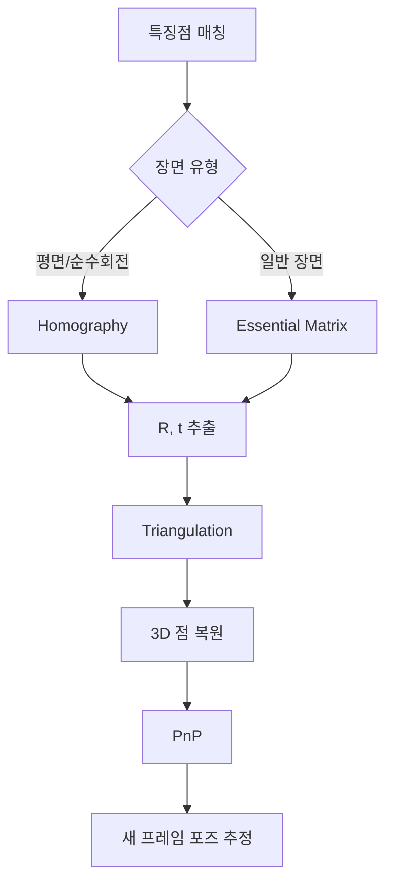

# Week 3: SVD (특이값 분해) 집중

## 📌 개요

**SVD (Singular Value Decomposition, 특이값 분해)** 는 Visual SLAM에서 가장 빈번하게 사용되는 행렬 분해 기법입니다. Essential Matrix에서 카메라 포즈(R, t)를 추출하거나, Homography 분해, PnP 문제 해결 등 거의 모든 기하학적 문제에서 SVD가 등장합니다.

이번 주에는 SVD의 **기하학적 직관**을 얻고, 실제 코드로 구현해보며 SLAM에서의 활용을 이해합니다.

## 🎯 학습 목표

1. SVD의 기하학적 의미 이해 (회전 → 스케일 → 회전)
2. 특이값(Singular Value)의 의미 파악
3. SVD를 이용한 최소자승 해 구하기
4. NumPy로 SVD 분해 실습
5. SLAM에서 SVD가 사용되는 핵심 장면 이해

## 📚 사전 지식

- Week 1-2에서 학습한 선형대수 기본 개념
- 행렬 곱셈, 역행렬, 고유값 분해
- Python NumPy 기본 사용법

## ⏱️ 예상 학습 시간

| 항목 | 시간 |
|------|------|
| 이론 학습 | 2-3시간 |
| 실습 예제 | 2-3시간 |
| SLAM 응용 이해 | 1-2시간 |
| **총 소요시간** | **5-8시간** |

---

## 📖 이론: SVD란 무엇인가?

### 🤔 먼저, 왜 SVD가 필요한가?

**고유값 분해(Eigenvalue Decomposition)** 를 Week 2에서 배웠는데, 이건 **정방 행렬(n×n)** 에만 적용됩니다.

그런데 현실에서는 **직사각 행렬(m×n)**이 더 많습니다:
- 이미지: 480×640 (행≠열)
- 8개의 대응점으로 Essential Matrix 구할 때: 8×9 행렬
- 센서 데이터: 측정 횟수 × 변수 개수 (대부분 다름)

> [!IMPORTANT]
> **SVD는 어떤 크기의 행렬이든 분해할 수 있는 "만능 도구"입니다!**

---

### 📌 핵심 정의

임의의 m×n 행렬 A는 다음과 같이 분해됩니다:

```
A = U Σ Vᵀ
```

이게 무슨 뜻인지 하나씩 풀어봅시다.

---

### 🧱 각 행렬의 의미

행렬 A가 **m×n** 크기라고 하면:

| 행렬 | 크기 | 성질 | 비유 |
|------|------|------|------|
| **U** | m×m | 직교 행렬 (열벡터가 정규직교) | "출력 공간의 좌표축" |
| **Σ** | m×n | 대각 행렬 (대각선에만 값 있음) | "각 축으로 얼마나 늘리기/줄이기" |
| **Vᵀ** | n×n | 직교 행렬 (행벡터가 정규직교) | "입력 공간의 좌표축" |

```
예: 3×2 행렬 A

A = U    ×   Σ   ×  Vᵀ
[3×2] [3×3] × [3×2] × [2×2]
```

---

### 🎨 비유로 이해하기: "포토샵 변환"

이미지를 편집할 때 변환을 생각해보세요:

```
원본 이미지 → [회전] → [늘리기/줄이기] → [또 회전] → 결과 이미지
```

**SVD가 말하는 것:**
> "어떤 복잡한 변환이든, 사실은 **회전 → 스케일 → 회전** 3단계로 분해할 수 있다!"

```
입력 벡터 x
    ↓
   Vᵀ (첫 번째 회전: 입력을 새로운 좌표축으로 정렬)
    ↓
    Σ (스케일: 각 축 방향으로 늘이기/줄이기)
    ↓
    U (두 번째 회전: 출력 방향으로 돌리기)
    ↓
결과 벡터 y = Ax
```

---

### 📐 아주 간단한 예제

**2×2 대각 행렬을 SVD 해봅시다:**

```python
import numpy as np

A = np.array([
    [3, 0],
    [0, 2]
])

U, S, Vt = np.linalg.svd(A)

print("U =\n", U)    # 단위행렬 (회전 없음)
print("S =", S)      # [3, 2] - 특이값들
print("Vt =\n", Vt)  # 단위행렬 (회전 없음)
```

**해석:**
- 이 행렬 A는 이미 **대각 행렬**이라서
- 회전 없음 (U와 Vt가 단위행렬)
- x축 방향으로 3배, y축 방향으로 2배 스케일

---

### 🔄 더 복잡한 예제 (회전이 있는 경우)

```python
A = np.array([
    [2, 1],
    [1, 2]
])

U, S, Vt = np.linalg.svd(A)
# S = [3, 1] - 특이값
```

**이 행렬은:**
1. 먼저 Vᵀ로 45도 만큼 회전
2. 한 축은 3배, 다른 축은 1배로 스케일
3. 다시 U로 회전

→ 결과적으로 특정 방향으로 늘어난 변환!

---

### 📏 직사각 행렬 예제 (m ≠ n)

**SVD의 강점: 정방 행렬이 아니어도 분해 가능!**

```python
# 3×2 행렬 (행 > 열)
A = np.array([
    [1, 2],
    [3, 4],
    [5, 6]
])

U, S, Vt = np.linalg.svd(A, full_matrices=True)

print(f"A 크기: {A.shape}")      # (3, 2)
print(f"U 크기: {U.shape}")      # (3, 3)
print(f"S (특이값): {S}")        # [9.53, 0.51]
print(f"Vt 크기: {Vt.shape}")    # (2, 2)
```

**핵심 포인트:**
```
A     =    U    ×    Σ    ×   Vᵀ
(3×2)   (3×3)    (3×2)    (2×2)
```

- **Σ (시그마)** 행렬도 직사각형 (3×2)이 됨!
- 대각선에만 특이값이 있고, 나머지는 0

```
Σ = [9.53   0  ]
    [  0   0.51]
    [  0    0  ]   ← 행이 더 많아서 0 행 추가
```

---

### 🔀 반대 경우: 열이 더 많은 행렬 (m < n)

```python
# 2×4 행렬 (열 > 행)
B = np.array([
    [1, 2, 3, 4],
    [5, 6, 7, 8]
])

U, S, Vt = np.linalg.svd(B, full_matrices=True)

print(f"B 크기: {B.shape}")      # (2, 4)
print(f"U 크기: {U.shape}")      # (2, 2)
print(f"S (특이값): {S}")        # [14.27, 1.00]
print(f"Vt 크기: {Vt.shape}")    # (4, 4)
```

**Σ 행렬 모양:**
```
Σ = [14.27   0    0    0]
    [  0    1.00  0    0]
              ↑
        열이 더 많아서 0 열 추가
```

> [!TIP]
> **복원 공식을 이해하면 크기가 명확해집니다:**
> ```
> A(m×n) = U(m×m) × Σ(m×n) × Vᵀ(n×n)
> ```
> 행렬 곱셈이 가능하려면 이 크기가 맞아야 합니다!

### 기하학적 해석: 회전-스케일-회전

SVD의 핵심 직관은 **모든 선형 변환은 세 단계로 분해된다**는 것입니다:

```
      Vᵀ          Σ           U
[입력] → [회전/반사] → [축 방향 스케일] → [회전/반사] → [출력]
```

1. **Vᵀ (첫 번째 회전)**: 입력 공간에서 좌표축 정렬
2. **Σ (스케일링)**: 각 축 방향으로 늘이기/줄이기
3. **U (두 번째 회전)**: 출력 공간에서 최종 방향 조정

---

### 🎯 특이값(σ)의 의미

특이값은 **Σ 행렬의 대각선 원소**입니다:

```
Σ = [σ₁  0   0 ]
    [0   σ₂  0 ]
    [0   0   σ₃]
```

| 특이값 | 의미 | 비유 |
|--------|------|------|
| **σ₁ (가장 큼)** | 가장 중요한 정보 방향 | "메인 스토리" |
| **σ₂** | 두 번째로 중요한 방향 | "서브 스토리" |
| **σₖ ≈ 0** | 거의 무시해도 되는 정보 | "노이즈" |
| **σ = 0** | 그 방향 정보 완전히 없음 | "빈 공간" |

- **σ₁ ≥ σ₂ ≥ ... ≥ σᵣ ≥ 0**: 항상 **양수**이고 **내림차순**
- **랭크(rank)**: 0이 아닌 특이값의 개수 = 행렬의 랭크

---

### 🆚 고유값 분해 vs SVD

| | 고유값 분해 (EVD) | 특이값 분해 (SVD) |
|--|------------------|------------------|
| **적용 가능** | 정방 행렬 (n×n)만 | **모든 행렬 (m×n)** |
| **분해 형태** | A = VΛV⁻¹ | A = UΣVᵀ |
| **U, V 관계** | 같은 행렬 (V = V) | 다른 행렬 (U ≠ V) |
| **값의 범위** | 음수 가능 | **항상 0 이상** |
| **대칭 행렬일 때** | 고유값 = 특이값 | 동일 |

---

### 🤖 SLAM에서 왜 SVD를 쓰는가?

**핵심 문제:** `Ax = 0` 형태의 방정식을 풀어야 함

예: 8개의 대응점으로 Essential Matrix를 구할 때
```
[x₂x₁  x₂y₁  x₂  y₂x₁  y₂y₁  y₂  x₁  y₁  1] × [e₁ e₂ ... e₉]ᵀ = 0
```

**SVD로 Ax = 0의 해 찾기:**
```python
U, S, Vt = np.linalg.svd(A)

# 최소 특이값에 대응하는 벡터 = Ax = 0의 해
solution = Vt[-1]  # V의 마지막 행 (= V의 마지막 열)
```

**왜 이게 해인가?**
- Ax = 0의 해는 A의 **영공간(Null Space)** 에 있음
- 영공간 = 특이값이 0인 방향
- SVD에서 마지막 특이값이 가장 작으므로, **Vt의 마지막 행**이 가장 가까운 해!

---

### 📝 SVD를 한 문장으로

> **"어떤 행렬이든 '회전 → 스케일 → 회전'으로 분해할 수 있고, 특이값은 각 방향의 중요도를 알려준다."**

---

## 🔧 SVD의 핵심 응용

### 1. 최소자승 해 (Least Squares Solution)

과결정 시스템 `Ax = b`에서 정확한 해가 없을 때:

```python
# 최소자승 해: x = V Σ⁺ Uᵀ b
# 여기서 Σ⁺는 Σ의 유사역행렬 (각 σᵢ를 1/σᵢ로)
x = np.linalg.lstsq(A, b, rcond=None)[0]
```

### 2. 저랭크 근사 (Low-Rank Approximation)

```python
# 상위 k개 특이값만 사용하여 행렬 근사
A_approx = U[:, :k] @ np.diag(S[:k]) @ Vt[:k, :]
```

### 3. Null Space (영공간) 찾기

```python
# Ax = 0의 해 = V의 마지막 열 (σ=0에 대응하는 벡터)
null_space = Vt[-1, :]
```

---

## 🤖 SLAM 핵심 개념과 SVD 활용

Visual SLAM에서 SVD는 기하학적 문제를 푸는 핵심 도구입니다. 아래에서 네 가지 핵심 개념을 자세히 설명합니다.

---

### 1. Essential Matrix (기본 행렬)

#### 개념

**Essential Matrix (E)** 는 두 카메라 사이의 **상대적인 회전(R)과 평행이동(t)** 을 인코딩한 3×3 행렬입니다.

```
두 이미지에서 대응점 p₁, p₂가 있을 때:
p₂ᵀ · E · p₁ = 0  (Epipolar Constraint)
```

#### 기하학적 의미

```
          에피폴라 평면
         /          \
        /            \
   카메라1 -------- 카메라2
       \    3D 점    /
        \     P     /
         \   /\   /
          \ /  \ /
          p₁    p₂
       (이미지1) (이미지2)
```

- 3D 점 P와 두 카메라 중심을 잇는 **에피폴라 평면**
- p₂는 반드시 **에피폴라 라인** 위에 있어야 함
- E는 이 기하학적 제약을 수학적으로 표현

#### E의 성질

| 성질 | 설명 |
|------|------|
| 랭크 = 2 | 세 번째 특이값이 0 |
| 특이값 | [σ, σ, 0] 형태 (두 개가 동일) |
| 자유도 | 5 DOF (3 회전 + 2 방향, 스케일 불가) |

#### SVD로 R, t 추출

```python
import numpy as np

def decompose_essential_matrix(E):
    """Essential Matrix에서 R, t 추출"""
    U, S, Vt = np.linalg.svd(E)
    
    # 특이값 보정: [σ, σ, 0] 형태로 강제
    S_corrected = np.diag([1, 1, 0])
    E_corrected = U @ S_corrected @ Vt
    
    # W 행렬 (90도 회전)
    W = np.array([
        [0, -1, 0],
        [1, 0, 0],
        [0, 0, 1]
    ])
    
    # 4가지 가능한 해
    R1 = U @ W @ Vt
    R2 = U @ W.T @ Vt
    t1 = U[:, 2]
    t2 = -U[:, 2]
    
    # det(R) = 1 보장
    if np.linalg.det(R1) < 0:
        R1 = -R1
    if np.linalg.det(R2) < 0:
        R2 = -R2
    
    return [(R1, t1), (R1, t2), (R2, t1), (R2, t2)]
```

> [!IMPORTANT]
> **Cheirality Check**: 4개의 (R, t) 후보 중 **3D 점이 두 카메라 앞에 있는** 경우만 유효합니다. Triangulation 후 양의 깊이를 갖는 해를 선택합니다.

#### 8점 알고리즘으로 E 계산

```python
def compute_essential_8point(pts1, pts2):
    """8점 알고리즘으로 Essential Matrix 계산"""
    # Ax = 0 형태로 변환 (x는 E의 9개 원소)
    A = []
    for p1, p2 in zip(pts1, pts2):
        x1, y1 = p1
        x2, y2 = p2
        A.append([x2*x1, x2*y1, x2, y2*x1, y2*y1, y2, x1, y1, 1])
    A = np.array(A)
    
    # SVD로 null space 찾기
    U, S, Vt = np.linalg.svd(A)
    E = Vt[-1].reshape(3, 3)  # 최소 특이값에 대응하는 벡터
    
    # 랭크 2 제약 적용
    U, S, Vt = np.linalg.svd(E)
    E = U @ np.diag([S[0], S[1], 0]) @ Vt
    
    return E
```

---

### 2. Homography (호모그래피)

#### 개념

**Homography (H)** 는 **동일 평면 위의 점들** 또는 **순수 회전** 일 때, 두 이미지 간의 변환을 나타내는 3×3 행렬입니다.

```
동차 좌표로: p₂ ~ H · p₁
(~는 스케일 불변 동치)
```

#### 기하학적 의미

```
        평면 (π)
       +--------+
      /|       /|
     / |      / |
    +--+-----+  |
    | 3D 점들 | |
    |  (동일  | /
    |  평면)  |/
    +---------+
       ↓ ↓
  이미지1  이미지2
```

- 평면 위의 점들만 고려할 때 성립
- 예: 바닥, 벽, 포스터 등 평면 물체

#### Homography 적용 사례

| 상황 | 설명 |
|------|------|
| 평면 물체 | 바닥면, 벽면의 특징점 매칭 |
| 순수 회전 | 카메라가 제자리에서만 회전 |
| 이미지 정합 | 파노라마 스티칭 |
| AR 마커 | 평면 마커 포즈 추정 |

#### DLT (Direct Linear Transform)로 H 계산

```python
def compute_homography_dlt(pts1, pts2):
    """DLT 알고리즘으로 Homography 계산"""
    A = []
    for (x1, y1), (x2, y2) in zip(pts1, pts2):
        A.append([-x1, -y1, -1, 0, 0, 0, x2*x1, x2*y1, x2])
        A.append([0, 0, 0, -x1, -y1, -1, y2*x1, y2*y1, y2])
    A = np.array(A)
    
    # SVD로 null space 찾기
    U, S, Vt = np.linalg.svd(A)
    H = Vt[-1].reshape(3, 3)
    
    # 정규화 (H[2,2] = 1)
    H = H / H[2, 2]
    
    return H
```

#### Homography 분해

```python
def decompose_homography(H, K):
    """Homography에서 R, t, n 추출 (카메라 내부 파라미터 K 필요)"""
    # 정규화된 homography
    H_normalized = np.linalg.inv(K) @ H @ K
    
    # SVD 분해
    U, S, Vt = np.linalg.svd(H_normalized)
    
    # 스케일 보정
    H_normalized = H_normalized / S[1]
    
    # 여러 해 중 선택 필요 (복잡한 분해 과정)
    # OpenCV: cv2.decomposeHomographyMat() 사용 권장
    return decomposed_solutions
```

---

### 3. PnP (Perspective-n-Point)

#### 개념

**PnP**는 **n개의 3D-2D 대응점**이 주어졌을 때, **카메라 포즈(R, t)를 추정**하는 문제입니다.

```
입력: 3D 점 {Pᵢ} (월드 좌표계), 2D 점 {pᵢ} (이미지)
출력: 카메라 포즈 [R | t]
```

#### 기하학적 의미

```
        월드 좌표계
           P₁ ●
              \
               \  ← 3D 점들의 위치를 알고 있음
                \
    P₂ ●---------+-------- P₃ ●
                 |
                 | ← 어디서 촬영했을까?
                 |
              [카메라]
                 ↓
             이미지 (p₁, p₂, p₃)
```

#### PnP 문제의 종류

| 최소 점 수 | 알고리즘 | 특징 |
|-----------|----------|------|
| 3점 (P3P) | P3P | 최소 해, 최대 4개 해 |
| 4점 (P4P) | 다양 | EPnP, DLT 등 |
| n점 | EPnP, DLT | 과결정 시스템, 최소자승 |

#### DLT 기반 PnP (SVD 활용)

```python
def pnp_dlt(pts_3d, pts_2d, K):
    """DLT 기반 PnP 풀이"""
    # 카메라 내부 파라미터로 정규화
    pts_2d_normalized = []
    K_inv = np.linalg.inv(K)
    for p in pts_2d:
        p_h = np.array([p[0], p[1], 1])
        p_n = K_inv @ p_h
        pts_2d_normalized.append(p_n[:2])
    
    # A 행렬 구성
    A = []
    for P, p in zip(pts_3d, pts_2d_normalized):
        X, Y, Z = P
        u, v = p
        A.append([X, Y, Z, 1, 0, 0, 0, 0, -u*X, -u*Y, -u*Z, -u])
        A.append([0, 0, 0, 0, X, Y, Z, 1, -v*X, -v*Y, -v*Z, -v])
    A = np.array(A)
    
    # SVD로 해 구하기
    U, S, Vt = np.linalg.svd(A)
    P_matrix = Vt[-1].reshape(3, 4)
    
    # R, t 추출 및 R 정규화
    R = P_matrix[:, :3]
    t = P_matrix[:, 3]
    
    # SVD로 가장 가까운 회전 행렬 찾기
    U_r, _, Vt_r = np.linalg.svd(R)
    R = U_r @ Vt_r
    if np.linalg.det(R) < 0:
        R = -R
        t = -t
    
    return R, t
```

#### OpenCV에서 PnP

```python
import cv2

# solvePnP: 반복적 최적화
success, rvec, tvec = cv2.solvePnP(
    pts_3d, pts_2d, K, dist_coeffs,
    flags=cv2.SOLVEPNP_ITERATIVE
)

# solvePnPRansac: RANSAC으로 아웃라이어 제거
success, rvec, tvec, inliers = cv2.solvePnPRansac(
    pts_3d, pts_2d, K, dist_coeffs
)
```

---

### 4. Triangulation (삼각측량)

#### 개념

**Triangulation**은 **두 개 이상의 카메라에서 관측된 2D 점**으로부터 **3D 점 위치를 복원**하는 문제입니다.

```
입력: 2D 점 p₁, p₂ + 카메라 행렬 P₁, P₂
출력: 3D 점 X
```

#### 기하학적 의미

```
          3D 점 X ● (알고 싶은 것)
                / \
               /   \
           광선1    광선2
             /       \
            /         \
       카메라1      카메라2
          ↓           ↓
         p₁           p₂
      (관측)        (관측)
```

- 이상적으로 두 광선이 3D 점에서 교차
- 실제로는 **노이즈로 인해 교차하지 않음**
- → 최소자승 해로 근사

#### Linear Triangulation (DLT)

```python
def triangulate_dlt(p1, p2, P1, P2):
    """DLT 기반 Triangulation
    
    Args:
        p1, p2: 2D 점 (정규화된 좌표)
        P1, P2: 카메라 투영 행렬 (3x4)
    
    Returns:
        X: 3D 점 (동차 좌표)
    """
    x1, y1 = p1
    x2, y2 = p2
    
    # A 행렬 구성 (각 대응점마다 2개 방정식)
    A = np.array([
        x1 * P1[2] - P1[0],
        y1 * P1[2] - P1[1],
        x2 * P2[2] - P2[0],
        y2 * P2[2] - P2[1]
    ])
    
    # SVD로 AX = 0의 해 구하기
    U, S, Vt = np.linalg.svd(A)
    X = Vt[-1]  # 최소 특이값에 대응하는 벡터
    
    # 동차 좌표 → 유클리드 좌표
    X = X / X[3]
    
    return X[:3]
```

#### 깊이 검증 (Cheirality Check)

```python
def check_cheirality(X, R, t):
    """3D 점이 카메라 앞에 있는지 확인"""
    # 카메라 좌표계에서의 점
    X_cam = R @ X + t
    
    # Z > 0이면 카메라 앞에 있음
    return X_cam[2] > 0
```

#### OpenCV에서 Triangulation

```python
import cv2

# 투영 행렬
P1 = K @ np.hstack([np.eye(3), np.zeros((3, 1))])
P2 = K @ np.hstack([R, t.reshape(3, 1)])

# Triangulation
pts_4d = cv2.triangulatePoints(P1, P2, pts1.T, pts2.T)

# 동차 좌표 → 유클리드 좌표
pts_3d = pts_4d[:3] / pts_4d[3]
```

---

### 요약: 네 가지 문제의 관계



| 문제 | 입력 | 출력 | SVD 역할 |
|------|------|------|----------|
| **Essential Matrix** | 2D-2D 대응점 | E 행렬 | Ax=0 해, R/t 분해 |
| **Homography** | 2D-2D 대응점 (평면) | H 행렬 | Ax=0 해, 분해 |
| **Triangulation** | 2D-2D + 카메라 포즈 | 3D 점 | Ax=0 해 |
| **PnP** | 3D-2D 대응점 | 카메라 포즈 | DLT 해, R 정규화 |

---

## 💻 실습 파일

이 폴더에 포함된 실습 파일:

| 파일 | 내용 |
|------|------|
| `svd_basics.py` | SVD 기본 개념 및 기하학적 의미 실습 |
| `svd_quiz.py` | 주관식 퀴즈 (문제/답안 분리) |

### 실행 방법

```bash
cd studies/phase1_math/week3
python3 svd_basics.py
python3 svd_quiz.py
```

---

## 🎬 추천 영상

| 영상 | 설명 |
|------|------|
| [3Blue1Brown - But what is the SVD?](https://www.youtube.com/watch?v=vSczTbgc8Rc) | SVD 직관 이해 (필수!) |
| [Steve Brunton - SVD](https://www.youtube.com/watch?v=gXbThCXjZFM) | 공학적 관점에서의 SVD |
| [Cyrill Stachniss - Essential Matrix](https://www.youtube.com/watch?v=zX5NeY-GTO0) | SLAM에서 Essential Matrix |

---

## ✅ 학습 완료 체크리스트

- [ ] SVD의 기하학적 의미를 "회전-스케일-회전"으로 설명할 수 있다
- [ ] 특이값이 0인 것과 랭크의 관계를 설명할 수 있다
- [ ] NumPy로 SVD 분해를 수행하고 결과를 해석할 수 있다
- [ ] Essential Matrix에서 R, t 추출에 SVD가 왜 필요한지 이해한다
- [ ] Ax = 0 형태의 문제에서 영공간(null space)을 SVD로 구할 수 있다

---

## 🔗 다음 단계

Week 3 완료 후 → **Week 4: 회전 표현**으로 이동
- 회전 행렬, 오일러 각, 쿼터니언 학습
- SVD가 회전 행렬 정규화에도 사용됨을 확인
