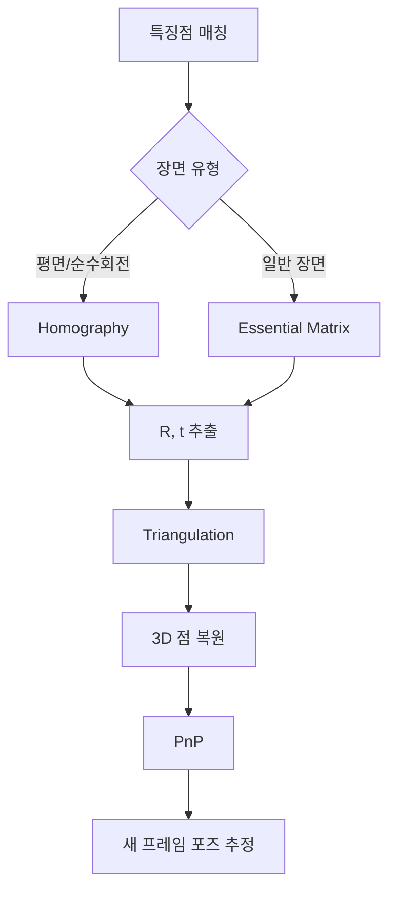

# Week 3: SVD (특이값 분해) 집중

## 📌 개요

**SVD (Singular Value Decomposition, 특이값 분해)** 는 Visual SLAM에서 가장 빈번하게 사용되는 행렬 분해 기법입니다. Essential Matrix에서 카메라 포즈(R, t)를 추출하거나, Homography 분해, PnP 문제 해결 등 거의 모든 기하학적 문제에서 SVD가 등장합니다.

이번 주에는 SVD의 **기하학적 직관**을 얻고, 실제 코드로 구현해보며 SLAM에서의 활용을 이해합니다.

## 🎯 학습 목표

1. SVD의 기하학적 의미 이해 (회전 → 스케일 → 회전)
2. 특이값(Singular Value)의 의미 파악
3. SVD를 이용한 최소자승 해 구하기
4. NumPy로 SVD 분해 실습
5. SLAM에서 SVD가 사용되는 핵심 장면 이해

## 📚 사전 지식

- Week 1-2에서 학습한 선형대수 기본 개념
- 행렬 곱셈, 역행렬, 고유값 분해
- Python NumPy 기본 사용법

## ⏱️ 예상 학습 시간

| 항목 | 시간 |
|------|------|
| 이론 학습 | 2-3시간 |
| 실습 예제 | 2-3시간 |
| SLAM 응용 이해 | 1-2시간 |
| **총 소요시간** | **5-8시간** |

---

## 📖 이론: SVD란 무엇인가?

### 🤔 먼저, 왜 SVD가 필요한가?

**고유값 분해(Eigenvalue Decomposition)** 를 Week 2에서 배웠는데, 이건 **정방 행렬(n×n)** 에만 적용됩니다.

그런데 현실에서는 **직사각 행렬(m×n)** 이 더 많습니다:
- 이미지: 480×640 (행≠열)
- 8개의 대응점으로 Essential Matrix 구할 때: 8×9 행렬
- 센서 데이터: 측정 횟수 × 변수 개수 (대부분 다름)

> [!IMPORTANT]
> **SVD는 어떤 크기의 행렬이든 분해할 수 있는 "만능 도구"입니다!**

### 🔍 "분해"란 정확히 무엇인가?

**분해(Decomposition)** 란 **복잡한 행렬을 더 단순하고 의미 있는 조각들로 쪼개는 것**입니다.

#### 비유: 화학의 원소 분해
```
물(H₂O) → 수소(H₂) + 산소(O)
복잡한 분자 → 기본 원소들로 분리
```

#### SVD 분해
```
행렬 A → U (회전) + Σ (스케일) + Vᵀ (회전)
복잡한 변환 → 3가지 기본 동작으로 분리
```

### 📊 분해하면 무엇을 얻는가?

```python
import numpy as np

# 직사각 행렬 (3행 × 2열)
A = np.array([
    [3, 2],
    [2, 3],
    [2, -2]
])

U, S, Vt = np.linalg.svd(A)
```

| 결과물 | 의미 | 알 수 있는 것 |
|--------|------|---------------|
| **U** (3×3) | 출력 공간의 축 방향 | 결과가 어느 방향으로 뻗어있는지 |
| **S** (특이값) | 각 축의 중요도/크기 | [5.0, 3.0] → 첫 방향이 더 중요 |
| **Vᵀ** (2×2) | 입력 공간의 축 방향 | 입력 데이터의 주요 패턴 방향 |

### 🎯 분해 결과로 할 수 있는 것들

#### 1. 행렬의 "중요도" 파악

```
특이값 S = [100, 50, 0.001, 0.0002]
        ↓     ↓      ↓        ↓
      매우   중요   거의     무시
      중요          노이즈   가능
```
→ 큰 특이값 = 중요한 정보, 작은 특이값 = 노이즈

#### 2. 랭크(Rank) = 독립적인 정보의 개수

```
S = [5.0, 3.0, 0.0]  → 랭크 = 2 (0이 아닌 특이값 개수)
                       → 실제 정보는 2차원에만 있음!
```

#### 3. 원래 행렬 복원 (U × Σ × Vᵀ = A)

```python
# Σ 행렬 구성 (대각 행렬)
Sigma = np.zeros((3, 2))
Sigma[0, 0], Sigma[1, 1] = S[0], S[1]

# 복원: A ≈ U × Σ × Vᵀ
A_reconstructed = U @ Sigma @ Vt
print(np.allclose(A, A_reconstructed))  # True
```

#### 4. 압축 (상위 k개만 사용)

```python
# 첫 번째 특이값만 사용 (가장 중요한 정보만)
k = 1
A_compressed = U[:, :k] @ np.diag(S[:k]) @ Vt[:k, :]
# 원본의 핵심만 남긴 "요약본"
```

### 🛠️ 실용 예시: 이미지 압축

```
1000×1000 이미지 = 100만 픽셀 저장 필요

SVD 후 상위 50개 특이값만 사용:
- 저장량: 50 × (1000 + 1 + 1000) = 10만 개
- 압축률: 10% (원본의 1/10)
- 품질: 육안으로 거의 차이 없음!
```

### 🔑 SLAM에서 SVD가 필수인 4가지 이유

#### 1. Ax = 0 형태의 동차 방정식 풀기
```
예: 8-point 알고리즘으로 Essential Matrix 계산
    → 8개 대응점 → 8×9 행렬 → 정방 행렬이 아님!
    → SVD로 Null space 찾기 (마지막 특이벡터 = 해)
```

#### 2. Essential Matrix에서 R, t 분해
```
E = U Σ Vᵀ로 분해 → 회전 R과 이동 t 추출
→ 카메라가 어디로 얼마나 움직였는지 알 수 있음
```

#### 3. 최소자승 문제 (과결정 시스템)
```
측정값 > 미지수 → 정확한 해 없음
SVD로 오차를 최소화하는 최적해 계산
예: 여러 점으로 직선/평면 피팅
```

#### 4. 노이즈 제거 (저랭크 근사)
```
센서 데이터에서 중요한 특이값만 남기고 나머지 제거
→ 노이즈는 작은 특이값에 분포 → 자연스럽게 제거
```

> [!TIP]
> **한 문장 요약**: SVD는 "어떤 크기의 행렬이든 분해해서 핵심 정보를 추출"할 수 있는 만능 도구입니다. 고유값 분해는 정방 행렬에만 쓸 수 있지만, 현실의 데이터(이미지, 센서, 대응점)는 대부분 직사각 행렬이라서 SVD가 필수입니다.

---

### 💡 `full_matrices` 파라미터 이해

NumPy의 `np.linalg.svd()`에서 `full_matrices` 옵션은 U와 V 행렬의 크기를 결정합니다.

행렬 A가 **m×n** 크기일 때 (k = min(m, n)):

| `full_matrices` | U 크기 | S 크기 | Vᵀ 크기 | 용도 |
|-----------------|--------|--------|---------|------|
| `True` (기본값) | m×m | k | n×n | Null space 분석, 완전한 직교 기저 필요 시 |
| `False` | m×k | k | k×n | 메모리/계산 효율, 대부분의 실용적 사용 |

```python
import numpy as np

A = np.array([[1, 2], [3, 4], [5, 6]])  # 3×2 행렬

# full_matrices=True (전체 SVD)
U_full, S, Vt_full = np.linalg.svd(A, full_matrices=True)
print(f"U: {U_full.shape}, Vᵀ: {Vt_full.shape}")  # U: (3,3), Vᵀ: (2,2)

# full_matrices=False (축소 SVD)
U_reduced, S, Vt_reduced = np.linalg.svd(A, full_matrices=False)
print(f"U: {U_reduced.shape}, Vᵀ: {Vt_reduced.shape}")  # U: (3,2), Vᵀ: (2,2)
```

**SLAM에서의 선택 기준:**
- **Homography/Essential Matrix 분해** → `True` (Null space 벡터 필요)
- **최소자승 해, 이미지 압축** → `False` (효율성)

---

### 📌 핵심 정의

임의의 m×n 행렬 A는 다음과 같이 분해됩니다:

```
A = U Σ Vᵀ
```

이게 무슨 뜻인지 하나씩 풀어봅시다.

---

### 🧱 각 행렬의 의미

행렬 A가 **m×n** 크기라고 하면:

| 행렬 | 크기 | 성질 | 비유 |
|------|------|------|------|
| **U** | m×m | 직교 행렬 (열벡터가 정규직교) | "출력 공간의 좌표축" |
| **Σ** | m×n | 대각 행렬 (대각선에만 값 있음) | "각 축으로 얼마나 늘리기/줄이기" |
| **Vᵀ** | n×n | 직교 행렬 (행벡터가 정규직교) | "입력 공간의 좌표축" |

```
예: 3×2 행렬 A

A = U    ×   Σ   ×  Vᵀ
[3×2] [3×3] × [3×2] × [2×2]
```

---

### 📏 Σ(특이값) 행렬의 크기는 어떻게 결정되는가?

원본 행렬 A가 **m × n** 크기일 때:

```
특이값 개수 = min(m, n)  ← 행과 열 중 작은 값
Σ 행렬 크기 = m × n      ← 원본과 동일!
```

#### 왜 이렇게 될까?

```
A     =    U    ×    Σ    ×    Vᵀ
(m×n)   (m×m)     (m×n)     (n×n)
```

**행렬 곱셈이 가능하려면:**
- U(m×m) × Σ → Σ가 **m개 행** 필요
- Σ × Vᵀ(n×n) → Σ가 **n개 열** 필요
- 따라서 Σ는 **m×n** 크기!

**대각선에만 값이 있으므로:**
- 대각선 길이 = min(m, n)
- 특이값 개수 = min(m, n)

#### 예시

| 원본 A | Σ 크기 | 특이값 개수 | 구조 |
|--------|--------|-------------|------|
| 3×2 | 3×2 | 2개 | `[σ₁ 0; 0 σ₂; 0 0]` (남는 행은 0) |
| 2×4 | 2×4 | 2개 | `[σ₁ 0 0 0; 0 σ₂ 0 0]` (남는 열은 0) |
| 3×3 | 3×3 | 3개 | `[σ₁ 0 0; 0 σ₂ 0; 0 0 σ₃]` |

> [!WARNING]
> **NumPy 주의사항**: `np.linalg.svd()`는 Σ 행렬이 아닌 **특이값 1D 배열**을 반환합니다.
> ```python
> U, S, Vt = np.linalg.svd(A)
> print(S.shape)  # (2,) ← 1D 배열!
> 
> # Σ 행렬을 직접 만들려면:
> Sigma = np.zeros((m, n))
> Sigma[:len(S), :len(S)] = np.diag(S)
> ```

---

### 🎨 비유로 이해하기: "포토샵 변환"

이미지를 편집할 때 변환을 생각해보세요:

```
원본 이미지 → [회전] → [늘리기/줄이기] → [또 회전] → 결과 이미지
```

**SVD가 말하는 것:**
> "어떤 복잡한 변환이든, 사실은 **회전 → 스케일 → 회전** 3단계로 분해할 수 있다!"

```
입력 벡터 x
    ↓
   Vᵀ (첫 번째 회전: 입력을 새로운 좌표축으로 정렬)
    ↓
    Σ (스케일: 각 축 방향으로 늘이기/줄이기)
    ↓
    U (두 번째 회전: 출력 방향으로 돌리기)
    ↓
결과 벡터 y = Ax
```

---

### 📐 아주 간단한 예제

**2×2 대각 행렬을 SVD 해봅시다:**

```python
import numpy as np

A = np.array([
    [3, 0],
    [0, 2]
])

U, S, Vt = np.linalg.svd(A)

print("U =\n", U)    # 단위행렬 (회전 없음)
print("S =", S)      # [3, 2] - 특이값들
print("Vt =\n", Vt)  # 단위행렬 (회전 없음)
```

**해석:**
- 이 행렬 A는 이미 **대각 행렬**이라서
- 회전 없음 (U와 Vt가 단위행렬)
- x축 방향으로 3배, y축 방향으로 2배 스케일

---

### 🔄 "회전이 있다/없다"의 의미 상세 설명

SVD는 행렬 A를 다음과 같이 분해합니다:

**A = U × Σ × Vᵀ**

여기서:
- **U**: 출력 공간에서의 회전 (왼쪽 특이벡터들)
- **Σ**: 각 축 방향으로의 스케일링 (늘리기/줄이기)
- **Vᵀ**: 입력 공간에서의 회전 (오른쪽 특이벡터들)

#### 📐 대각 행렬: 회전 없음 (U, Vᵀ = 단위행렬)

```python
diagonal_A = np.array([
    [3, 0],
    [0, 2]
])
```

이 행렬의 SVD 결과:
- **U ≈ 단위행렬 (Identity Matrix)**
- **Vᵀ ≈ 단위행렬 (Identity Matrix)**

**왜 "회전 없음"인가?**

단위행렬은 **아무것도 하지 않는 변환**입니다:
```
[1, 0]     회전각 = 0°
[0, 1]
```

대각 행렬 `[[3, 0], [0, 2]]`가 벡터에 하는 일:
1. x축 방향으로 **3배** 늘림
2. y축 방향으로 **2배** 늘림
3. **회전은 전혀 없음!**

```
원래 벡터 (1,1) → 변환 후 (3,2)
     ↑                    ↑
   정사각형            직사각형 (축 방향 그대로)
```

#### 🔄 비대각 행렬: 회전 있음 (U, Vᵀ ≠ 단위행렬)

```python
rotation_scale_A = np.array([
    [2, 1],
    [1, 2]
])
```

이 행렬의 SVD 결과:
- **U ≠ 단위행렬** (약 45° 회전 포함)
- **Vᵀ ≠ 단위행렬** (약 45° 회전 포함)

**왜 "회전 있음"인가?**

비대각 원소 `1`이 있다는 것은 **x축과 y축이 서로 섞인다**는 의미입니다.

```
원래 벡터 (1,0) → 변환 후 (2,1)
     ↑                    ↑
   x축 방향            대각선 방향으로 기울어짐!
```

**변환 과정을 단계별로 보면:**

1. **Vᵀ 회전**: 입력 벡터를 먼저 회전 (약 45°)
2. **Σ 스케일**: 주축 방향으로 늘리기 (특이값 3과 1)
3. **U 회전**: 최종 출력을 다시 회전 (약 45°)

#### 📊 시각적 비교

| | 대각 행렬 (회전 없음) | 비대각 행렬 (회전 있음) |
|---|---|---|
| **원** | → **타원** (축 정렬) | → **타원** (기울어짐) |
| **U, Vᵀ** | 단위행렬 | 단위행렬 아님 |
| **의미** | 순수한 스케일링 | 회전 + 스케일링 |

> [!TIP]
> **핵심 포인트:**
> - **U, Vᵀ가 단위행렬** → 순수한 스케일 변환 (방향 유지)
> - **U, Vᵀ가 단위행렬이 아님** → 회전이 포함된 변환 (방향 변경)
>
> SLAM에서 이것이 중요한 이유: 로봇의 움직임을 **회전 성분**과 **이동/스케일 성분**으로 분리해서 분석할 수 있기 때문입니다!

---

### 🔄 더 복잡한 예제 (회전이 있는 경우)

```python
A = np.array([
    [2, 1],
    [1, 2]
])

U, S, Vt = np.linalg.svd(A)
# S = [3, 1] - 특이값
```

**이 행렬은:**
1. 먼저 Vᵀ로 45도 만큼 회전
2. 한 축은 3배, 다른 축은 1배로 스케일
3. 다시 U로 회전

→ 결과적으로 특정 방향으로 늘어난 변환!

---

### 📏 직사각 행렬 예제 (m ≠ n)

**SVD의 강점: 정방 행렬이 아니어도 분해 가능!**

```python
# 3×2 행렬 (행 > 열)
A = np.array([
    [1, 2],
    [3, 4],
    [5, 6]
])

U, S, Vt = np.linalg.svd(A, full_matrices=True)

print(f"A 크기: {A.shape}")      # (3, 2)
print(f"U 크기: {U.shape}")      # (3, 3)
print(f"S (특이값): {S}")        # [9.53, 0.51]
print(f"Vt 크기: {Vt.shape}")    # (2, 2)
```

**핵심 포인트:**
```
A     =    U    ×    Σ    ×   Vᵀ
(3×2)   (3×3)    (3×2)    (2×2)
```

- **Σ (시그마)** 행렬도 직사각형 (3×2)이 됨!
- 대각선에만 특이값이 있고, 나머지는 0

```
Σ = [9.53   0  ]
    [  0   0.51]
    [  0    0  ]   ← 행이 더 많아서 0 행 추가
```

---

### 🔀 반대 경우: 열이 더 많은 행렬 (m < n)

```python
# 2×4 행렬 (열 > 행)
B = np.array([
    [1, 2, 3, 4],
    [5, 6, 7, 8]
])

U, S, Vt = np.linalg.svd(B, full_matrices=True)

print(f"B 크기: {B.shape}")      # (2, 4)
print(f"U 크기: {U.shape}")      # (2, 2)
print(f"S (특이값): {S}")        # [14.27, 1.00]
print(f"Vt 크기: {Vt.shape}")    # (4, 4)
```

**Σ 행렬 모양:**
```
Σ = [14.27   0    0    0]
    [  0    1.00  0    0]
              ↑
        열이 더 많아서 0 열 추가
```

> [!TIP]
> **복원 공식을 이해하면 크기가 명확해집니다:**
> ```
> A(m×n) = U(m×m) × Σ(m×n) × Vᵀ(n×n)
> ```
> 행렬 곱셈이 가능하려면 이 크기가 맞아야 합니다!

### 기하학적 해석: 회전-스케일-회전

SVD의 핵심 직관은 **모든 선형 변환은 세 단계로 분해된다**는 것입니다:

```
      Vᵀ          Σ           U
[입력] → [회전/반사] → [축 방향 스케일] → [회전/반사] → [출력]
```

1. **Vᵀ (첫 번째 회전)**: 입력 공간에서 좌표축 정렬
2. **Σ (스케일링)**: 각 축 방향으로 늘이기/줄이기
3. **U (두 번째 회전)**: 출력 공간에서 최종 방향 조정

#### ❓ 왜 계산 순서가 "반대"인가?

많은 사람들이 혼란스러워하는 부분입니다:

**A = U × Σ × Vᵀ** 인데, 왜 벡터에 적용할 때는 **Vᵀ → Σ → U** 순서로 계산할까요?

> [!IMPORTANT]
> **행렬 곱셈의 결합법칙** 때문입니다!

**벡터 x에 A를 적용:**
```
y = A × x = (U × Σ × Vᵀ) × x
```

행렬 곱셈은 **오른쪽에서 왼쪽으로** 계산됩니다:
```
(U × Σ × Vᵀ) × x = U × (Σ × (Vᵀ × x))
                    ↑     ↑      ↑
                  3단계  2단계   1단계 (먼저!)
```

**계산 순서:**
1. **1단계**: Vᵀ × x를 먼저 계산
2. **2단계**: Σ × (1단계 결과)를 계산
3. **3단계**: U × (2단계 결과)를 계산

**비유 - 함수 합성:**
```
f(g(h(x))) 를 계산할 때:
1. h(x) 먼저
2. g(결과)
3. f(결과)

마찬가지로 (U × Σ × Vᵀ) × x:
1. Vᵀ × x 먼저
2. Σ × (결과)
3. U × (결과)
```

**실제 예시:**
```
입력 벡터: [0.707, 0.707]

1단계 - Vᵀ 적용: [-1.0, 0.0]    ← 먼저 회전
2단계 - Σ 적용:  [-3.0, 0.0]    ← 스케일링
3단계 - U 적용:  [2.12, 2.12]   ← 최종 회전
```

**정리:**
- **A = U × Σ × Vᵀ**: 행렬들의 곱셈 "순서" (왼쪽에서 오른쪽)
- **A × x 계산**: 벡터에 적용 "순서" (오른쪽에서 왼쪽)

이것은 "순서가 반대"가 아니라, **행렬 표기법과 실제 계산 법칙의 차이**입니다! ✅

---

### ✍️ 특이값을 손으로 계산하는 방법

컴퓨터에 의존하지 않고 손으로 특이값을 계산하는 수학적 과정을 이해하면 SVD의 본질을 더 깊이 이해할 수 있습니다.

#### 📐 계산 공식

행렬 **A** (m×n)의 특이값을 구하는 단계:

> [!IMPORTANT]
> **왜 A^T A를 사용하는가?**
> 
> m×n 직사각 행렬 A는 **직접 고유값을 구할 수 없습니다!** (고유값은 정방 행렬에만 정의됨)
> 
> 따라서 A를 정방 행렬로 변환:
> - **A^T A**: n×n 정방 행렬 (n = 열의 개수)
> - **A A^T**: m×m 정방 행렬 (m = 행의 개수)
> 
> 일반적으로 **A^T A**를 사용합니다 (보통 n ≤ m이므로 계산이 더 효율적).

**1단계: A^T A 계산**
```
A^T A를 계산합니다 (결과는 n×n 대칭 행렬)
```

**예시:**
```
A가 3×2 행렬이면:
  A^T (2×3) × A (3×2) = A^T A (2×2) ✅ 정방 행렬!
```

**2단계: 고유값(λ) 구하기**

특성방정식(characteristic equation)을 풉니다:
```
det(A^T A - λI) = 0
```
이 방정식의 해가 고유값 λ₁, λ₂, ..., λₙ입니다.

**3단계: 특이값(σ) 계산**

특이값은 고유값의 제곱근입니다:
```
σᵢ = √λᵢ
```

관례적으로 특이값은 **내림차순**으로 정렬합니다:
```
σ₁ ≥ σ₂ ≥ ... ≥ σₙ ≥ 0
```

#### 💡 핵심 원리

**왜 A^T A의 고유값을 사용하는가?**

```
A = U Σ Vᵀ라면:

A^T A = (U Σ Vᵀ)^T (U Σ Vᵀ)
      = V Σᵀ Uᵀ U Σ Vᵀ
      = V Σᵀ Σ Vᵀ     (∵ Uᵀ U = I)
      = V diag(σ₁², σ₂², ..., σₙ²) Vᵀ
```

따라서 **A^T A의 고유값 = σᵢ²** (특이값의 제곱)입니다!

#### 📝 손계산 예제: 2×2 행렬

행렬 **A = [[3, 0], [4, 5]]** 의 특이값을 구해봅시다.

**1단계: A^T A 계산**
```
A^T = [[3, 4],
       [0, 5]]

A^T A = [[3, 4],  × [[3, 0],
         [0, 5]]     [4, 5]]

      = [[3×3 + 4×4,  3×0 + 4×5],
         [0×3 + 5×4,  0×0 + 5×5]]

      = [[25, 20],
         [20, 25]]
```

**2단계: 특성방정식 풀기**
```
det(A^T A - λI) = 0

det([[25-λ,   20  ],
     [  20,  25-λ]]) = 0

(25-λ)(25-λ) - 20×20 = 0
(25-λ)² - 400 = 0
625 - 50λ + λ² - 400 = 0
λ² - 50λ + 225 = 0
```

근의 공식 사용:
```
λ = (50 ± √(2500 - 900)) / 2
  = (50 ± √1600) / 2
  = (50 ± 40) / 2

λ₁ = 45
λ₂ = 5
```

**3단계: 특이값 계산**
```
σ₁ = √45 = 3√5 ≈ 6.708
σ₂ = √5  ≈ 2.236
```

**최종 결과:**
```
특이값: [6.708, 2.236]
```

#### 🔍 검증 (NumPy 비교)

```python
import numpy as np

A = np.array([[3, 0], [4, 5]])
U, S, Vt = np.linalg.svd(A)
print(f"S = {S}")  # [6.7082, 2.2361]
```

완벽하게 일치합니다! ✅

#### 📐 손계산 예제: m×n 직사각 행렬 (3×2)

이제 **실제 직사각 행렬**의 특이값을 계산해봅시다. 행렬 **A = [[1, 0], [0, 1], [1, 1]]** 의 특이값을 구합니다.

**1단계: A^T A 계산**
```
A (3×2):          A^T (2×3):
[[1, 0],          [[1, 0, 1],
 [0, 1],           [0, 1, 1]]
 [1, 1]]

A^T A = [[1, 0, 1],  × [[1, 0],
         [0, 1, 1]]     [0, 1],
                        [1, 1]]

      = [[1×1 + 0×0 + 1×1,  1×0 + 0×1 + 1×1],
         [0×1 + 1×0 + 1×1,  0×0 + 1×1 + 1×1]]

      = [[2, 1],
         [1, 2]]
```

**핵심 포인트:** 
- 원래 A는 3×2 (직사각!)
- A^T A는 2×2 (정방 행렬!) → 고유값 계산 가능!

**2단계: 특성방정식 풀기**
```
det(A^T A - λI) = 0

det([[2-λ,   1  ],
     [ 1,   2-λ]]) = 0

(2-λ)(2-λ) - 1×1 = 0
(2-λ)² - 1 = 0
4 - 4λ + λ² - 1 = 0
λ² - 4λ + 3 = 0
```

인수분해:
```
(λ - 3)(λ - 1) = 0

λ₁ = 3
λ₂ = 1
```

**3단계: 특이값 계산**
```
σ₁ = √λ₁ = √3 ≈ 1.732
σ₂ = √λ₂ = √1 = 1.000
```

**최종 결과:**
```
3×2 행렬 A의 특이값: [1.732, 1.000]
```

**검증 (NumPy):**
```python
import numpy as np

A = np.array([[1, 0], [0, 1], [1, 1]])
U, S, Vt = np.linalg.svd(A)
print(f"S = {S}")  # [1.7321, 1.0000]
```

완벽하게 일치! ✅

**기하학적 의미:**
- 3×2 행렬 A는 2D 공간을 3D 공간으로 매핑
- 특이값 [1.732, 1.000]은 두 주축 방향의 스케일링
- 첫 번째 방향은 약 1.73배, 두 번째 방향은 1배로 늘어남

---

#### 🔄 비교: A^T A vs A A^T

같은 행렬 A에 대해 **A A^T**를 사용하면 어떻게 될까요?

**A A^T 계산:**
```
A A^T = [[1, 0],  × [[1, 0, 1],  = [[1, 0, 1],
         [0, 1],     [0, 1, 1]]     [0, 1, 1],
         [1, 1]]                     [1, 1, 2]]

      = [[1×1 + 0×0,  1×0 + 0×1,  1×1 + 0×1],
         [0×1 + 1×0,  0×0 + 1×1,  0×1 + 1×1],
         [1×1 + 1×0,  1×0 + 1×1,  1×1 + 1×1]]

      = [[1, 0, 1],
         [0, 1, 1],
         [1, 1, 2]]  (3×3 행렬)
```

**특성방정식:** (3×3이므로 3차 방정식!)
```
det(A A^T - λI) = 0
→ λ³ - 4λ² + 3λ = 0
→ λ(λ² - 4λ + 3) = 0
→ λ(λ - 3)(λ - 1) = 0

고유값: λ₁ = 3, λ₂ = 1, λ₃ = 0
```

**특이값:**
```
σ₁ = √3 ≈ 1.732
σ₂ = √1 = 1.000
σ₃ = √0 = 0.000
```

**결론:**
- **0이 아닌 특이값은 동일**: [1.732, 1.000] ✅
- A A^T는 추가 특이값 0을 포함 (행렬이 3×3이지만 랭크는 2)
- **A^T A가 더 효율적**: 더 작은 행렬(2×2 vs 3×3)로 동일한 결과!

> [!TIP]
> **실전 팁**: 직사각 행렬 A (m×n)의 특이값을 구할 때는 **min(m, n)** 크기의 정방 행렬을 만드는 것이 효율적입니다.
> - m > n이면 → **A^T A** (n×n) 사용 ✅
> - m < n이면 → **A A^T** (m×m) 사용 ✅

---

#### 📏 3×3 이상의 행렬

3×3 이상의 행렬에서는:
- 3차 방정식 이상을 풀어야 합니다
- 근의 공식이 복잡하거나 수치적 방법 필요
- 실전에서는 컴퓨터 사용이 필수

하지만 **원리는 동일**합니다:
1. A^T A 계산
2. det(A^T A - λI) = 0 풀기
3. σ = √λ

> [!TIP]
> **SLAM에서의 의미**: 손계산 과정을 이해하면, 특이값이 행렬의 "에너지" 또는 "중요도"를 어떻게 담고 있는지 직관적으로 알 수 있습니다. 작은 특이값(≈0)은 노이즈나 불필요한 정보를 나타내므로, 제거해도 원래 데이터의 본질은 유지됩니다.

---

### 🎯 특이값(σ)의 의미

특이값은 **Σ 행렬의 대각선 원소**입니다:

```
Σ = [σ₁  0   0 ]
    [0   σ₂  0 ]
    [0   0   σ₃]
```

| 특이값 | 의미 | 비유 |
|--------|------|------|
| **σ₁ (가장 큼)** | 가장 중요한 정보 방향 | "메인 스토리" |
| **σ₂** | 두 번째로 중요한 방향 | "서브 스토리" |
| **σₖ ≈ 0** | 거의 무시해도 되는 정보 | "노이즈" |
| **σ = 0** | 그 방향 정보 완전히 없음 | "빈 공간" |

- **σ₁ ≥ σ₂ ≥ ... ≥ σᵣ ≥ 0**: 항상 **양수**이고 **내림차순**
- **랭크(rank)**: 0이 아닌 특이값의 개수 = 행렬의 랭크

---

### 📏 랭크(Rank)를 특이값으로 계산하기

#### 수학적 원리

행렬의 **랭크(rank)** 는 **선형독립인 행(또는 열)의 개수**를 의미합니다. SVD를 사용하면 이를 특이값으로 쉽게 계산할 수 있습니다.

> [!IMPORTANT]
> **핵심 정리**: 행렬의 랭크 = 0이 아닌 특이값의 개수

#### 왜 `np.sum(s > 1e-10)`으로 랭크를 계산하는가?

**1단계: 이론적 배경**

```python
import numpy as np

# 풀 랭크 행렬 (2×2, 랭크 = 2)
full_rank = np.array([
    [1, 2],
    [3, 4]
])

_, s1, _ = np.linalg.svd(full_rank)
print(f"특이값: {s1}")  # [5.4650, 0.3650]
print(f"랭크: {len(s1)}")  # 2 (모두 0이 아님)
```

```python
# 랭크 부족 행렬 (2×2, 랭크 = 1)
rank_deficient = np.array([
    [1, 2],
    [2, 4]  # 첫 번째 행의 2배 → 선형 종속
])

_, s2, _ = np.linalg.svd(rank_deficient)
print(f"특이값: {s2}")  # [5.4772, 0.0000]
print(f"랭크: ?")  # 이론적으로 1이지만...
```

**2단계: 실제 문제 - 수치 오차(Numerical Error)**

컴퓨터는 부동소수점 연산에서 완벽한 0을 만들지 못합니다:

```python
print(s2)  # [5.47722558, 0.00000000]
# 하지만 실제로는:
print(s2[1])  # 3.7747582837255322e-16 ← 완벽한 0이 아님!
```

**왜 이런 일이 발생하는가?**
- 부동소수점 산술의 반올림 오차
- 행렬 곱셈/분해 과정의 누적 오차
- 이론적으로 0인 값이 **매우 작은 값**(~10⁻¹⁶)으로 계산됨

**3단계: 허용 오차(Tolerance) 사용**

```python
# ❌ 잘못된 방법: 정확히 0인 개수 세기
rank_wrong = np.sum(s2 == 0)  # 0 (수치 오차 때문에!)

# ✅ 올바른 방법: 허용 오차 사용
tolerance = 1e-10  # 0.0000000001
rank_correct = np.sum(s2 > tolerance)  # 1 ✅
```

#### 허용 오차 값 선택 가이드

| 허용 오차 | 용도 | 설명 |
|----------|------|------|
| `1e-10` | **일반적 사용** ✅ | 대부분의 경우에 적합 |
| `1e-15` | 고정밀 계산 | 매우 정확한 데이터일 때 |
| `1e-6` | 노이즈가 많은 데이터 | 센서 데이터, 실험 측정 |
| `rcond` parameter | NumPy 기본값 | 행렬 크기에 따라 자동 조정 |

```python
# NumPy의 자동 허용 오차
# rcond = max(m, n) × machine_epsilon
# machine_epsilon ≈ 2.22e-16 (float64)
```

#### 실전 예제

**예제 1: 완전 랭크 행렬**

```python
A = np.array([
    [1, 2],
    [3, 4]
])

U, s, Vt = np.linalg.svd(A)
print(f"특이값: {s}")  # [5.4650, 0.3650]
print(f"s > 1e-10: {s > 1e-10}")  # [True, True]
print(f"랭크: {np.sum(s > 1e-10)}")  # 2
```

**예제 2: 랭크 부족 행렬**

```python
B = np.array([
    [1, 2, 3],
    [2, 4, 6],
    [3, 6, 9]
])

U, s, Vt = np.linalg.svd(B)
print(f"특이값: {s}")  # [16.8481, 0.0000, 0.0000]
print(f"s > 1e-10: {s > 1e-10}")  # [True, False, False]
print(f"랭크: {np.sum(s > 1e-10)}")  # 1
```

**예제 3: 직사각 행렬**

```python
C = np.array([
    [1, 2],
    [3, 4],
    [5, 6]
])

U, s, Vt = np.linalg.svd(C)
print(f"특이값: {s}")  # [9.5256, 0.5143]
print(f"랭크: {np.sum(s > 1e-10)}")  # 2 (min(3, 2) = 2)
```

#### 코드 분석: `s > 1e-10`의 동작 원리

```python
s = np.array([5.477, 0.365, 0.0000000001])

# 1단계: 불린 배열 생성
boolean_array = s > 1e-10
print(boolean_array)  # [True, True, False]

# 2단계: True를 1로, False를 0으로 변환하여 합산
rank = np.sum(boolean_array)
print(rank)  # 2

# NumPy의 sum()은 불린 값을 자동 변환:
# True → 1
# False → 0
```

#### SLAM에서의 활용

**1. Essential Matrix 검증**

```python
# Essential Matrix는 랭크 2여야 함
E = compute_essential_matrix(pts1, pts2)
U, s, Vt = np.linalg.svd(E)
rank = np.sum(s > 1e-10)

if rank != 2:
    print("경고: 유효하지 않은 Essential Matrix")
```

**2. Homography 유효성 검사**

```python
# Homography는 풀 랭크(3)여야 함
H = compute_homography(pts1, pts2)
U, s, Vt = np.linalg.svd(H)
rank = np.sum(s > 1e-6)  # 노이즈가 많을 수 있으므로 더 큰 허용 오차

if rank < 3:
    print("경고: Homography 계산 실패 (랭크 부족)")
```

**3. 노이즈 제거 및 정규화**

```python
# 작은 특이값을 0으로 강제하여 노이즈 제거
U, s, Vt = np.linalg.svd(noisy_matrix)

# 랭크 결정
rank = np.sum(s > 1e-6)

# 작은 특이값 제거
s[rank:] = 0

# 깨끗한 행렬 복원
cleaned_matrix = U @ np.diag(s) @ Vt
```

---

### 🔢 조건수(Condition Number) 완벽 가이드

#### 📐 정의

**조건수(Condition Number)** 는 행렬의 **수치적 안정성**을 나타내는 지표입니다:

```
κ(A) = σ_max / σ_min = (가장 큰 특이값) / (가장 작은 특이값)
```

여기서:
- **σ_max**: 가장 큰 특이값 (가장 강한 방향)
- **σ_min**: 가장 작은 특이값 (가장 약한 방향)
- **κ(A)**: 조건수 (kappa, condition number)

#### 🤔 왜 중요한가?

조건수는 **"입력의 작은 변화가 출력을 얼마나 크게 바꾸는가?"** 를 측정합니다.

**비유: 다리 건너기**

```
조건수가 작은 행렬 (κ ≈ 1~100):
    넓고 튼튼한 다리 → 안전하게 건널 수 있음
    
조건수가 큰 행렬 (κ > 1000):
    좁고 흔들리는 다리 → 작은 바람에도 위험
    
조건수가 매우 큰 행렬 (κ → ∞):
    거의 끊어진 다리 → 건너기 불가능 (singular)
```

#### 📊 수학적 의미

선형 시스템 **Ax = b**를 풀 때:

```
b의 상대 오차: δb / ||b||
   ↓
x의 상대 오차: ≤ κ(A) × (δb / ||b||)
   ↑
입력 오차가 최대 κ(A)배만큼 증폭됨!
```

**예시:**
```python
# 조건수 = 1000인 행렬
# 입력(b)에 0.1% 오차 → 출력(x)에 최대 100% 오차 가능!
κ = 1000
input_error = 0.001  # 0.1%
max_output_error = κ * input_error  # 1.0 = 100%
```

#### 🔍 조건수로 행렬 분류

| 조건수 범위 | 분류 | 의미 | 대처 방법 |
|------------|------|------|----------|
| **κ ≈ 1** | 완벽한 조건 | 직교 행렬 (U, V) | 문제 없음 ✅ |
| **κ < 10** | 매우 안정 | 수치적으로 이상적 | 일반 알고리즘 사용 |
| **κ < 100** | 안정 | 대부분의 경우 안전 | 일반 알고리즘 사용 |
| **κ < 1,000** | 약간 불안정 | 주의 필요 | 정규화 고려 |
| **κ < 10⁶** | 불안정 (ill-conditioned) | 노이즈에 매우 민감 | 정규화 필수 ⚠️ |
| **κ > 10⁶** | 거의 특이 | 실질적으로 랭크 부족 | 다른 방법 사용 🚨 |
| **κ → ∞** | 특이 행렬 | 역행렬 없음 | 유사역행렬 사용 |

#### 💻 실전 예제

**예제 1: 안정적인 행렬 (작은 조건수)**

```python
import numpy as np

# 단위 행렬: 완벽한 조건 (κ = 1)
I = np.eye(3)
U, s, Vt = np.linalg.svd(I)
cond = s[0] / s[-1]
print(f"조건수: {cond}")  # 1.0 ✅
print("→ 가장 안정적인 행렬!")
```

**예제 2: 중간 조건수**

```python
# 일반적인 행렬
A = np.array([
    [1, 2],
    [3, 4]
])

U, s, Vt = np.linalg.svd(A)
cond = s[0] / s[-1]
print(f"특이값: {s}")  # [5.4650, 0.3650]
print(f"조건수: {cond:.2f}")  # 14.97
print("→ 안정적, 일반 계산 가능 ✅")
```

**예제 3: 불안정한 행렬 (큰 조건수)**

```python
# 거의 선형 종속인 행렬
B = np.array([
    [1.0, 2.0],
    [1.0, 2.0001]  # 거의 같은 행!
])

U, s, Vt = np.linalg.svd(B)
cond = s[0] / s[-1]
print(f"특이값: {s}")  # [3.1623, 0.0001]
print(f"조건수: {cond:.0f}")  # 31,623 ⚠️
print("→ 매우 불안정! 노이즈에 민감")
```

**예제 4: 특이 행렬 (무한대 조건수)**

```python
# 완전히 선형 종속
C = np.array([
    [1, 2],
    [2, 4]  # 첫 행의 2배
])

U, s, Vt = np.linalg.svd(C)
print(f"특이값: {s}")  # [5.4772, 0.0000]

# 0으로 나눌 수 없으므로 조건수 = 무한대
if s[-1] < 1e-10:
    print("조건수: ∞ (특이 행렬) 🚨")
else:
    cond = s[0] / s[-1]
    print(f"조건수: {cond}")
```

#### 🔬 조건수와 노이즈 증폭

**실험: 노이즈가 얼마나 증폭되는가?**

```python
import numpy as np

# 조건수가 다른 두 행렬
A_good = np.array([[1, 0], [0, 1]])  # 조건수 = 1
A_bad = np.array([[1, 1], [1, 1.001]])  # 조건수 ≈ 2000

b = np.array([1, 2])

# 정확한 해
x_good_exact = np.linalg.lstsq(A_good, b, rcond=None)[0]
x_bad_exact = np.linalg.lstsq(A_bad, b, rcond=None)[0]

# 작은 노이즈 추가 (1%)
noise = 0.01 * np.random.randn(2)
b_noisy = b + noise

# 노이즈가 있는 해
x_good_noisy = np.linalg.lstsq(A_good, b_noisy, rcond=None)[0]
x_bad_noisy = np.linalg.lstsq(A_bad, b_noisy, rcond=None)[0]

# 오차 비교
error_good = np.linalg.norm(x_good_exact - x_good_noisy) / np.linalg.norm(x_good_exact)
error_bad = np.linalg.norm(x_bad_exact - x_bad_noisy) / np.linalg.norm(x_bad_exact)

print(f"조건수가 작은 행렬의 오차: {error_good*100:.2f}%")
print(f"조건수가 큰 행렬의 오차: {error_bad*100:.2f}%")
print(f"오차 증폭 비율: {error_bad/error_good:.0f}배")
```

#### 🤖 SLAM에서의 조건수 중요성

**1. Bundle Adjustment**

```python
# 카메라 포즈와 3D 점을 동시에 최적화
# → 정규 방정식(Normal Equation)의 조건수가 중요

J = compute_jacobian(cameras, points)  # 야코비안
H = J.T @ J  # 헤시안 (정규 방정식)

U, s, Vt = np.linalg.svd(H)
cond = s[0] / s[-1]

if cond > 1e6:
    print("경고: 최적화가 불안정할 수 있음")
    # → Levenberg-Marquardt 사용 (정규화 추가)
```

**2. Essential Matrix 계산**

```python
# 8-point 알고리즘
A = construct_constraint_matrix(pts1, pts2)
U, s, Vt = np.linalg.svd(A)

cond = s[0] / s[-1]
if cond > 1000:
    print("경고: 특징점 분포가 좋지 않음")
    print("→ 더 분산된 특징점 필요")
```

**3. 삼각측량(Triangulation)**

```python
# 3D 점 복원
A = construct_triangulation_matrix(p1, p2, P1, P2)
U, s, Vt = np.linalg.svd(A)

cond = s[0] / s[-1]
if cond > 100:
    print("경고: 카메라 각도가 너무 작음")
    print("→ 더 큰 베이스라인 필요")
```

#### 🛠️ 조건수 개선 방법

**1. 정규화(Normalization)**

```python
# 데이터를 평균 0, 표준편차 1로 정규화
A_normalized = (A - A.mean(axis=0)) / A.std(axis=0)

# 조건수 비교
cond_before = np.linalg.cond(A)
cond_after = np.linalg.cond(A_normalized)
print(f"정규화 전: {cond_before:.0f}")
print(f"정규화 후: {cond_after:.0f}")
```

**2. 정규화 항 추가 (Regularization)**

```python
# Tikhonov 정규화 (Ridge Regression)
λ = 0.01  # 정규화 파라미터
A_reg = A.T @ A + λ * np.eye(A.shape[1])

# 조건수 개선
cond_before = np.linalg.cond(A.T @ A)
cond_after = np.linalg.cond(A_reg)
print(f"정규화 전: {cond_before:.0f}")
print(f"정규화 후: {cond_after:.0f}")
```

**3. Preconditioning**

```python
# 대각 스케일링
D = np.diag(1 / np.sqrt(np.diag(A.T @ A)))
A_preconditioned = A @ D

cond_before = np.linalg.cond(A)
cond_after = np.linalg.cond(A_preconditioned)
```

#### 🧮 NumPy에서 조건수 계산

**방법 1: SVD 사용 (권장)**

```python
U, s, Vt = np.linalg.svd(A)
cond = s[0] / s[-1]  # 가장 정확
```

**방법 2: NumPy 내장 함수**

```python
# L2 노름 기준 조건수
cond = np.linalg.cond(A)  # 기본값: L2 norm

# 다른 노름 사용 가능
cond_1 = np.linalg.cond(A, p=1)      # L1 norm
cond_inf = np.linalg.cond(A, p=np.inf)  # L∞ norm
cond_fro = np.linalg.cond(A, p='fro')   # Frobenius norm
```

#### ⚡ 조건수와 특이값의 관계

```python
import numpy as np
import matplotlib.pyplot as plt

# 다양한 조건수를 가진 행렬 생성
condition_numbers = [1, 10, 100, 1000, 10000]

for κ in condition_numbers:
    # 특이값 설정: [κ, 1]
    s = np.array([κ, 1.0])
    
    # 랜덤 직교 행렬
    U, _ = np.linalg.qr(np.random.randn(2, 2))
    V, _ = np.linalg.qr(np.random.randn(2, 2))
    
    # A = U @ diag(s) @ V.T
    A = U @ np.diag(s) @ V.T
    
    cond_check = np.linalg.cond(A)
    print(f"설정한 조건수: {κ:5.0f}, 실제: {cond_check:5.0f}")
```

#### 💡 핵심 정리

1. **정의**: 조건수 = σ_max / σ_min
   - 최대 특이값 ÷ 최소 특이값

2. **의미**: 입력 오차의 증폭 정도
   - κ = 1000 → 입력 0.1% 오차가 최대 100% 오차로 증폭

3. **기준**:
   - κ < 100: 안정 ✅
   - κ < 1000: 주의
   - κ > 10⁶: 위험 🚨

4. **SLAM 응용**:
   - Bundle Adjustment 안정성 검사
   - 특징점 분포 품질 평가
   - 삼각측량 정확도 예측

5. **개선 방법**:
   - 데이터 정규화
   - 정규화 항 추가 (Tikhonov)
   - Preconditioning

> [!WARNING]
> **조건수가 큰 행렬은 작은 측정 오차나 부동소수점 연산 오차에도 결과가 크게 달라질 수 있습니다. SLAM에서는 항상 조건수를 체크하고, 필요시 정규화를 적용해야 합니다!**

#### NumPy 내장 함수와 비교

```python
import numpy as np

A = np.array([[1, 2], [2, 4]])

# 방법 1: SVD로 직접 계산
U, s, Vt = np.linalg.svd(A)
rank_svd = np.sum(s > 1e-10)

# 방법 2: NumPy의 matrix_rank 함수
rank_numpy = np.linalg.matrix_rank(A)

print(f"SVD 계산: {rank_svd}")      # 1
print(f"NumPy 함수: {rank_numpy}")  # 1
print(f"일치: {rank_svd == rank_numpy}")  # True
```

> [!NOTE]
> `np.linalg.matrix_rank()`는 내부적으로 SVD를 사용하며, 자동으로 적절한 허용 오차를 계산합니다.

#### 💡 핵심 정리

1. **수학적 원리**: 행렬의 랭크 = 0이 아닌 특이값의 개수

2. **실전 구현**: `np.sum(s > tolerance)`
   - `tolerance`는 수치 오차를 고려한 임계값
   - 일반적으로 `1e-10` 사용

3. **코드 동작**:
   ```python
   s > 1e-10  # 불린 배열: [True, True, False, ...]
   np.sum(...)  # True=1, False=0으로 합산
   ```

4. **SLAM 응용**:
   - Essential Matrix 검증 (랭크 = 2)
   - Homography 유효성 (랭크 = 3)
   - 노이즈 제거 및 정규화

---

### 🆚 고유값 분해 vs SVD

| | 고유값 분해 (EVD) | 특이값 분해 (SVD) |
|--|------------------|------------------|
| **적용 가능** | 정방 행렬 (n×n)만 | **모든 행렬 (m×n)** |
| **분해 형태** | A = VΛV⁻¹ | A = UΣVᵀ |
| **U, V 관계** | 같은 행렬 (V = V) | 다른 행렬 (U ≠ V) |
| **값의 범위** | 음수 가능 | **항상 0 이상** |
| **대칭 행렬일 때** | 고유값 = 특이값 | 동일 |

---

### 🤖 SLAM에서 왜 SVD를 쓰는가?

**핵심 문제:** `Ax = 0` 형태의 방정식을 풀어야 함

예: 8개의 대응점으로 Essential Matrix를 구할 때
```
[x₂x₁  x₂y₁  x₂  y₂x₁  y₂y₁  y₂  x₁  y₁  1] × [e₁ e₂ ... e₉]ᵀ = 0
```

**SVD로 Ax = 0의 해 찾기:**
```python
U, S, Vt = np.linalg.svd(A)

# 최소 특이값에 대응하는 벡터 = Ax = 0의 해
solution = Vt[-1]  # V의 마지막 행 (= V의 마지막 열)
```

**왜 이게 해인가?**
- Ax = 0의 해는 A의 **영공간(Null Space)** 에 있음
- 영공간 = 특이값이 0인 방향
- SVD에서 마지막 특이값이 가장 작으므로, **Vt의 마지막 행**이 가장 가까운 해!

---

### 📝 SVD를 한 문장으로

> **"어떤 행렬이든 '회전 → 스케일 → 회전'으로 분해할 수 있고, 특이값은 각 방향의 중요도를 알려준다."**

---

## 🔧 SVD의 핵심 응용

### 1. 최소자승 해 (Least Squares Solution)

#### 📐 문제 정의

**과결정 시스템(Overdetermined System)** 은 방정식의 개수가 미지수보다 많은 경우입니다:

```
Ax = b
(m×n) × (n×1) = (m×1)
여기서 m > n (방정식 개수 > 미지수 개수)
```

이 경우 **정확한 해가 존재하지 않는 경우가 대부분**이므로, **잔차(residual)를 최소화**하는 해를 찾습니다.

#### 🎯 목표

다음을 최소화하는 x를 찾는 것:

```
minimize ||Ax - b||² = (Ax - b)ᵀ(Ax - b)
```

#### 💡 직관적 예시: 직선 피팅

```python
# 데이터: (1, 2.1), (2, 2.9), (3, 4.2), (4, 4.8)
# 목표: y = a + bx 형태의 직선 찾기

A = np.array([
    [1, 1],   # y₁ = a + b·1
    [1, 2],   # y₂ = a + b·2
    [1, 3],   # y₃ = a + b·3
    [1, 4]    # y₄ = a + b·4
])
b = np.array([2.1, 2.9, 4.2, 4.8])

# 4개 방정식, 2개 미지수 → 과결정 시스템
# 모든 점을 정확히 지나는 직선은 없음!
```

#### ✨ SVD를 이용한 해법

**1단계: SVD 분해**
```
A = U Σ Vᵀ
```

**2단계: 유사역행렬(Pseudoinverse) 계산**
```
A⁺ = V Σ⁺ Uᵀ
```
여기서 Σ⁺는 각 σᵢ를 1/σᵢ로 바꾼 것 (σᵢ ≈ 0이면 0 유지)

**3단계: 최소자승 해**
```
x = A⁺b = V Σ⁺ Uᵀ b
```

#### 💻 구현 예제

```python
import numpy as np

# 직선 피팅 문제
A = np.array([[1, 1], [1, 2], [1, 3], [1, 4]])
b = np.array([2.1, 2.9, 4.2, 4.8])

# 방법 1: NumPy 최소자승 (내부적으로 SVD 사용)
x_lstsq, residuals, _, _ = np.linalg.lstsq(A, b, rcond=None)
print(f"해: a = {x_lstsq[0]:.4f}, b = {x_lstsq[1]:.4f}")

# 방법 2: SVD로 직접 계산
U, S, Vt = np.linalg.svd(A, full_matrices=False)
S_inv = np.diag(1 / S)
A_pinv = Vt.T @ S_inv @ U.T
x_svd = A_pinv @ b

# 예측과 잔차
y_pred = A @ x_lstsq
residual = b - y_pred
print(f"잔차 제곱합: {np.sum(residual**2):.6f}")
```

#### 📊 정규방정식 vs SVD

| | 정규방정식 (AᵀA)⁻¹Aᵀb | SVD A⁺b |
|---|---|---|
| **수치 안정성** | 조건수 제곱 (불안정) ⚠️ | 안정적 ✅ |
| **랭크 부족** | 역행렬 없음 ❌ | 유사역행렬 사용 ✅ |
| **작은 특이값** | 큰 오차 증폭 | 자동 제거 가능 |

#### 🤖 SLAM에서의 활용

- **평면 피팅**: 3D 점들로부터 평면 방정식 추정
- **카메라 캘리브레이션**: DLT로 투영 행렬 계산
- **ICP**: 두 점군 정합에서 최적 R, t 찾기
- **Bundle Adjustment**: 카메라 포즈와 3D 점 동시 최적화

> [!TIP]
> SLAM에서는 거의 항상 **SVD 기반 최소자승**을 사용합니다. 노이즈가 많고 조건수가 나쁜 경우가 많기 때문입니다!

---

### 2. 저랭크 근사 (Low-Rank Approximation)

```python
# 상위 k개 특이값만 사용하여 행렬 근사
A_approx = U[:, :k] @ np.diag(S[:k]) @ Vt[:k, :]
```

### 3. Null Space (영공간) 찾기

```python
# Ax = 0의 해 = V의 마지막 열 (σ=0에 대응하는 벡터)
null_space = Vt[-1, :]
```

---

## 🤖 SLAM 핵심 개념과 SVD 활용

Visual SLAM에서 SVD는 기하학적 문제를 푸는 핵심 도구입니다. 아래에서 네 가지 핵심 개념을 자세히 설명합니다.

---

### 1. Essential Matrix (기본 행렬)

#### 개념

**Essential Matrix (E)** 는 두 카메라 사이의 **상대적인 회전(R)과 평행이동(t)** 을 인코딩한 3×3 행렬입니다.

```
두 이미지에서 대응점 p₁, p₂가 있을 때:
p₂ᵀ · E · p₁ = 0  (Epipolar Constraint)
```

#### 기하학적 의미

```
          에피폴라 평면
         /          \
        /            \
   카메라1 -------- 카메라2
       \    3D 점    /
        \     P     /
         \   /\   /
          \ /  \ /
          p₁    p₂
       (이미지1) (이미지2)
```

- 3D 점 P와 두 카메라 중심을 잇는 **에피폴라 평면**
- p₂는 반드시 **에피폴라 라인** 위에 있어야 함
- E는 이 기하학적 제약을 수학적으로 표현

#### E의 성질

| 성질 | 설명 |
|------|------|
| 랭크 = 2 | 세 번째 특이값이 0 |
| 특이값 | [σ, σ, 0] 형태 (두 개가 동일) |
| 자유도 | 5 DOF (3 회전 + 2 방향, 스케일 불가) |

#### SVD로 R, t 추출

```python
import numpy as np

def decompose_essential_matrix(E):
    """Essential Matrix에서 R, t 추출"""
    U, S, Vt = np.linalg.svd(E)
    
    # 특이값 보정: [σ, σ, 0] 형태로 강제
    S_corrected = np.diag([1, 1, 0])
    E_corrected = U @ S_corrected @ Vt
    
    # W 행렬 (90도 회전)
    W = np.array([
        [0, -1, 0],
        [1, 0, 0],
        [0, 0, 1]
    ])
    
    # 4가지 가능한 해
    R1 = U @ W @ Vt
    R2 = U @ W.T @ Vt
    t1 = U[:, 2]
    t2 = -U[:, 2]
    
    # det(R) = 1 보장
    if np.linalg.det(R1) < 0:
        R1 = -R1
    if np.linalg.det(R2) < 0:
        R2 = -R2
    
    return [(R1, t1), (R1, t2), (R2, t1), (R2, t2)]
```

> [!IMPORTANT]
> **Cheirality Check**: 4개의 (R, t) 후보 중 **3D 점이 두 카메라 앞에 있는** 경우만 유효합니다. Triangulation 후 양의 깊이를 갖는 해를 선택합니다.

#### 8점 알고리즘으로 E 계산

```python
def compute_essential_8point(pts1, pts2):
    """8점 알고리즘으로 Essential Matrix 계산"""
    # Ax = 0 형태로 변환 (x는 E의 9개 원소)
    A = []
    for p1, p2 in zip(pts1, pts2):
        x1, y1 = p1
        x2, y2 = p2
        A.append([x2*x1, x2*y1, x2, y2*x1, y2*y1, y2, x1, y1, 1])
    A = np.array(A)
    
    # SVD로 null space 찾기
    U, S, Vt = np.linalg.svd(A)
    E = Vt[-1].reshape(3, 3)  # 최소 특이값에 대응하는 벡터
    
    # 랭크 2 제약 적용
    U, S, Vt = np.linalg.svd(E)
    E = U @ np.diag([S[0], S[1], 0]) @ Vt
    
    return E
```

---

### 2. Homography (호모그래피)

#### 개념

**Homography (H)** 는 **동일 평면 위의 점들** 또는 **순수 회전** 일 때, 두 이미지 간의 변환을 나타내는 3×3 행렬입니다.

```
동차 좌표로: p₂ ~ H · p₁
(~는 스케일 불변 동치)
```

#### 기하학적 의미

```
        평면 (π)
       +--------+
      /|       /|
     / |      / |
    +--+-----+  |
    | 3D 점들 | |
    |  (동일  | /
    |  평면)  |/
    +---------+
       ↓ ↓
  이미지1  이미지2
```

- 평면 위의 점들만 고려할 때 성립
- 예: 바닥, 벽, 포스터 등 평면 물체

#### Homography 적용 사례

| 상황 | 설명 |
|------|------|
| 평면 물체 | 바닥면, 벽면의 특징점 매칭 |
| 순수 회전 | 카메라가 제자리에서만 회전 |
| 이미지 정합 | 파노라마 스티칭 |
| AR 마커 | 평면 마커 포즈 추정 |

#### DLT (Direct Linear Transform)로 H 계산

```python
def compute_homography_dlt(pts1, pts2):
    """DLT 알고리즘으로 Homography 계산"""
    A = []
    for (x1, y1), (x2, y2) in zip(pts1, pts2):
        A.append([-x1, -y1, -1, 0, 0, 0, x2*x1, x2*y1, x2])
        A.append([0, 0, 0, -x1, -y1, -1, y2*x1, y2*y1, y2])
    A = np.array(A)
    
    # SVD로 null space 찾기
    U, S, Vt = np.linalg.svd(A)
    H = Vt[-1].reshape(3, 3)
    
    # 정규화 (H[2,2] = 1)
    H = H / H[2, 2]
    
    return H
```

#### Homography 분해

```python
def decompose_homography(H, K):
    """Homography에서 R, t, n 추출 (카메라 내부 파라미터 K 필요)"""
    # 정규화된 homography
    H_normalized = np.linalg.inv(K) @ H @ K
    
    # SVD 분해
    U, S, Vt = np.linalg.svd(H_normalized)
    
    # 스케일 보정
    H_normalized = H_normalized / S[1]
    
    # 여러 해 중 선택 필요 (복잡한 분해 과정)
    # OpenCV: cv2.decomposeHomographyMat() 사용 권장
    return decomposed_solutions
```

---

### 3. PnP (Perspective-n-Point)

#### 개념

**PnP**는 **n개의 3D-2D 대응점**이 주어졌을 때, **카메라 포즈(R, t)를 추정**하는 문제입니다.

```
입력: 3D 점 {Pᵢ} (월드 좌표계), 2D 점 {pᵢ} (이미지)
출력: 카메라 포즈 [R | t]
```

#### 기하학적 의미

```
        월드 좌표계
           P₁ ●
              \
               \  ← 3D 점들의 위치를 알고 있음
                \
    P₂ ●---------+-------- P₃ ●
                 |
                 | ← 어디서 촬영했을까?
                 |
              [카메라]
                 ↓
             이미지 (p₁, p₂, p₃)
```

#### PnP 문제의 종류

| 최소 점 수 | 알고리즘 | 특징 |
|-----------|----------|------|
| 3점 (P3P) | P3P | 최소 해, 최대 4개 해 |
| 4점 (P4P) | 다양 | EPnP, DLT 등 |
| n점 | EPnP, DLT | 과결정 시스템, 최소자승 |

#### DLT 기반 PnP (SVD 활용)

```python
def pnp_dlt(pts_3d, pts_2d, K):
    """DLT 기반 PnP 풀이"""
    # 카메라 내부 파라미터로 정규화
    pts_2d_normalized = []
    K_inv = np.linalg.inv(K)
    for p in pts_2d:
        p_h = np.array([p[0], p[1], 1])
        p_n = K_inv @ p_h
        pts_2d_normalized.append(p_n[:2])
    
    # A 행렬 구성
    A = []
    for P, p in zip(pts_3d, pts_2d_normalized):
        X, Y, Z = P
        u, v = p
        A.append([X, Y, Z, 1, 0, 0, 0, 0, -u*X, -u*Y, -u*Z, -u])
        A.append([0, 0, 0, 0, X, Y, Z, 1, -v*X, -v*Y, -v*Z, -v])
    A = np.array(A)
    
    # SVD로 해 구하기
    U, S, Vt = np.linalg.svd(A)
    P_matrix = Vt[-1].reshape(3, 4)
    
    # R, t 추출 및 R 정규화
    R = P_matrix[:, :3]
    t = P_matrix[:, 3]
    
    # SVD로 가장 가까운 회전 행렬 찾기
    U_r, _, Vt_r = np.linalg.svd(R)
    R = U_r @ Vt_r
    if np.linalg.det(R) < 0:
        R = -R
        t = -t
    
    return R, t
```

#### OpenCV에서 PnP

```python
import cv2

# solvePnP: 반복적 최적화
success, rvec, tvec = cv2.solvePnP(
    pts_3d, pts_2d, K, dist_coeffs,
    flags=cv2.SOLVEPNP_ITERATIVE
)

# solvePnPRansac: RANSAC으로 아웃라이어 제거
success, rvec, tvec, inliers = cv2.solvePnPRansac(
    pts_3d, pts_2d, K, dist_coeffs
)
```

---

### 4. Triangulation (삼각측량)

#### 개념

**Triangulation**은 **두 개 이상의 카메라에서 관측된 2D 점**으로부터 **3D 점 위치를 복원**하는 문제입니다.

```
입력: 2D 점 p₁, p₂ + 카메라 행렬 P₁, P₂
출력: 3D 점 X
```

#### 기하학적 의미

```
          3D 점 X ● (알고 싶은 것)
                / \
               /   \
           광선1    광선2
             /       \
            /         \
       카메라1      카메라2
          ↓           ↓
         p₁           p₂
      (관측)        (관측)
```

- 이상적으로 두 광선이 3D 점에서 교차
- 실제로는 **노이즈로 인해 교차하지 않음**
- → 최소자승 해로 근사

#### Linear Triangulation (DLT)

```python
def triangulate_dlt(p1, p2, P1, P2):
    """DLT 기반 Triangulation
    
    Args:
        p1, p2: 2D 점 (정규화된 좌표)
        P1, P2: 카메라 투영 행렬 (3x4)
    
    Returns:
        X: 3D 점 (동차 좌표)
    """
    x1, y1 = p1
    x2, y2 = p2
    
    # A 행렬 구성 (각 대응점마다 2개 방정식)
    A = np.array([
        x1 * P1[2] - P1[0],
        y1 * P1[2] - P1[1],
        x2 * P2[2] - P2[0],
        y2 * P2[2] - P2[1]
    ])
    
    # SVD로 AX = 0의 해 구하기
    U, S, Vt = np.linalg.svd(A)
    X = Vt[-1]  # 최소 특이값에 대응하는 벡터
    
    # 동차 좌표 → 유클리드 좌표
    X = X / X[3]
    
    return X[:3]
```

#### 깊이 검증 (Cheirality Check)

```python
def check_cheirality(X, R, t):
    """3D 점이 카메라 앞에 있는지 확인"""
    # 카메라 좌표계에서의 점
    X_cam = R @ X + t
    
    # Z > 0이면 카메라 앞에 있음
    return X_cam[2] > 0
```

#### OpenCV에서 Triangulation

```python
import cv2

# 투영 행렬
P1 = K @ np.hstack([np.eye(3), np.zeros((3, 1))])
P2 = K @ np.hstack([R, t.reshape(3, 1)])

# Triangulation
pts_4d = cv2.triangulatePoints(P1, P2, pts1.T, pts2.T)

# 동차 좌표 → 유클리드 좌표
pts_3d = pts_4d[:3] / pts_4d[3]
```

---

### 요약: 네 가지 문제의 관계



| 문제 | 입력 | 출력 | SVD 역할 |
|------|------|------|----------|
| **Essential Matrix** | 2D-2D 대응점 | E 행렬 | Ax=0 해, R/t 분해 |
| **Homography** | 2D-2D 대응점 (평면) | H 행렬 | Ax=0 해, 분해 |
| **Triangulation** | 2D-2D + 카메라 포즈 | 3D 점 | Ax=0 해 |
| **PnP** | 3D-2D 대응점 | 카메라 포즈 | DLT 해, R 정규화 |

---

## 💻 실습 파일

이 폴더에 포함된 실습 파일:

| 파일 | 내용 |
|------|------|
| `svd_basics.py` | SVD 기본 개념 및 기하학적 의미 실습 |
| `svd_quiz.py` | 주관식 퀴즈 (문제/답안 분리) |

### 실행 방법

```bash
cd studies/phase1_math/week3
python3 svd_basics.py
python3 svd_quiz.py
```

---

## 🎬 추천 영상

| 영상 | 설명 |
|------|------|
| [3Blue1Brown - But what is the SVD?](https://www.youtube.com/watch?v=vSczTbgc8Rc) | SVD 직관 이해 (필수!) |
| [Steve Brunton - SVD](https://www.youtube.com/watch?v=gXbThCXjZFM) | 공학적 관점에서의 SVD |
| [Cyrill Stachniss - Essential Matrix](https://www.youtube.com/watch?v=zX5NeY-GTO0) | SLAM에서 Essential Matrix |

---

## ✅ 학습 완료 체크리스트

- [ ] SVD의 기하학적 의미를 "회전-스케일-회전"으로 설명할 수 있다
- [ ] 특이값이 0인 것과 랭크의 관계를 설명할 수 있다
- [ ] NumPy로 SVD 분해를 수행하고 결과를 해석할 수 있다
- [ ] Essential Matrix에서 R, t 추출에 SVD가 왜 필요한지 이해한다
- [ ] Ax = 0 형태의 문제에서 영공간(null space)을 SVD로 구할 수 있다

---

## 🔗 다음 단계

Week 3 완료 후 → **Week 4: 회전 표현**으로 이동
- 회전 행렬, 오일러 각, 쿼터니언 학습
- SVD가 회전 행렬 정규화에도 사용됨을 확인
